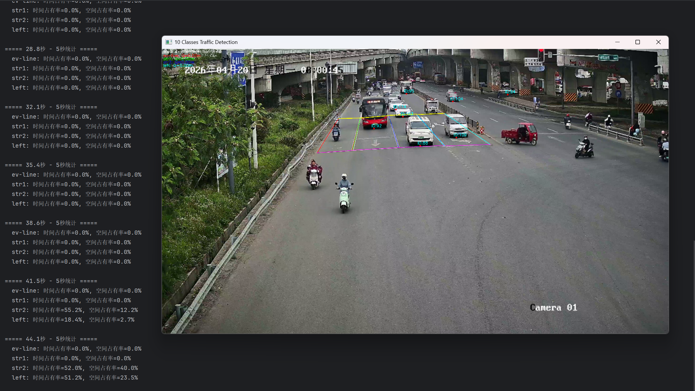

# 面向信控优化的交叉口多源交通视频智能检测系统

基于 **YOLOv26n** 与 **ByteTrack** 的端到端交通视频检测系统，专为大型信号交叉口（10车道）设计，可同步输出 **10类** 高精度交通数据，支撑自适应信号控制与交通数字孪生。

## ✨ 主要特性

- **高精度检测**：综合检测准确率达 **92.3%**（100组标准数据）
- **实时处理**：实测帧率达 **15 FPS**，满足边缘部署需求
- **多维度输出**：同步输出10类数据，涵盖断面、轨迹与统计三大维度
- **工程化设计**：内置数据清洗与抗噪机制，输出可直接对接信控平台

## 📊 输出数据

| 类别 | 数据项 | 时间粒度 |
|:---|:---|:---|
| 断面过车数据 | 车辆类型、车身颜色、到达/离去时间、瞬时速度、车头时距/间距 | 每车 |
| 轨迹数据 | 每秒坐标（世界坐标）、车辆ID | 每秒 |
| 统计数据 | 时间/空间占有率、流量、排队长度 | 5秒 / 分钟 / 秒级 |

## 🛠️ 技术栈

- **检测框架**：YOLOv26n（端到端无NMS设计）
- **跟踪算法**：ByteTrack
- **开发语言**：Python 3.8+
- **核心依赖**：PyTorch, OpenCV, NumPy, Pandas, Ultralytics
## 🎬 效果展示




## 🏗️ 项目结构
## 🏗️ 项目结构

```text
traffic-intelligent-detection/
├── config/
│   └── bytetrack.yaml          # ByteTrack 跟踪器配置
├── docs/                    # 输出结果（Excel）
│   └── demo.jpg
├── models/
│   ├── best.pt
│   └── READEM.md               # 模型权重文件说明 
├── outputs/                    # 输出结果（Excel）
│   └── .gitkeep
├── src/                        # 核心源代码
│   ├── main.py                 # 主程序入口
│   ├── config.py               # 配置参数
│   ├── calibration.py          # 透视变换
│   ├── color_detector.py       # 颜色识别
│   ├── lane_manager.py         # 车道管理
│   ├── queue_length.py         # 排队长度
│   ├── speed_calculator.py     # 速度计算
│   └── metrics_recorder.py     # 数据导出
├── tools/                      # 辅助工具
│   ├── calibrate_detect_lines.py   # 检测线标定
│   ├── calibrate_roi.py            # 车道ROI标定
│   ├── calibrate_perspective.py    # 透视变换标定
│   └── train.py                    # 模型训练
├── .gitignore
├── .gitattributes
├── perspective_matrix.npy
├── README.md
└── requirements.txt
```

## 🚀 快速开始

### 1. 环境配置

```bash
conda create -n traffic python=3.8
conda activate traffic
pip install -r requirements.txt

### 2. 准备文件

- 将训练好的模型权重 `best.pt` 放入 `models/` 目录
- 生成透视变换矩阵 `perspective_matrix.npy`，放入项目根目录（运行 `tools/calibrate_perspective.py` 进行标定）
- 将测试视频放入项目根目录，或修改 `src/config.py` 中的视频路径

### 3. 运行检测

```bash
python src/main.py
```

运行后，结果将自动导出到 `outputs/` 目录。

## 📄 开源协议

本项目采用 [MIT](LICENSE) 开源许可证。

## 🙏 致谢

- 感谢大赛组委会提供的平台与数据
  - 感谢 Ultralytics 团队开源的 YOLO 框架